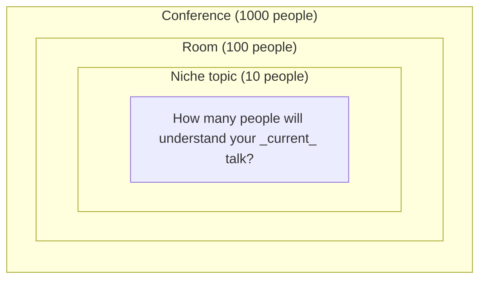
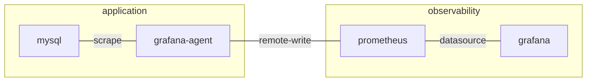

Regardless of whether your in a team setting or at a conference, speaking to a senior or a junior, you can reliably assume:
1. you will be misunderstood by _them_; and
2. you will misunderstand _them_.

Truth is, everyone is misunderstood and everyone misunderstands.

A healthy habit is to

> assume infinite ignorance, and infinite intelligence  
> _(Max Delbrück; or Leó Szilárd; or Stanisław Jerzy Lec; purportedly)_

and try to come up with an effective intro that will "collect" 1000 random people to begin to understand the talk you are about to deliver.

## Tables

Think of your talk as "context-0", enclose it by "context-1", then "context-2" and "context-3".

| Context level | Analogy          | Num. of people in each context                          |
| ------------- | ---------------- | ------------------------------------------------------- |
| 0             | Your talk        | $10^0=1$ (yourself)                                     |
| 1             | Your niche topic | $10^1=10$ (your closest cohort)                         |
| 2             | Room             | $10^2=100$ (people intrigued by the title of your talk) |
| 3             | Conference       | $10^3=1000$ (everyone attending the conference)         |

The goal of your intro is to **collect 3 orders of magnitude** outside of yourself. And **you can do it in under 1 minute**.

## Diagrams

Diagrams are phenomenal. A good diagram is a [minimalist diagram](https://en.wikipedia.org/wiki/Occam%27s_razor).
To produce one, you'd have to think hard what is relevant, and how much semantics is required to convey the point.

For example, consider a juju deployment diagram:

([Edit a copy of this diagram]([Online FlowChart & Diagrams Editor - Mermaid Live Editor](https://mermaid.live/edit#pako:eNpVkc1OwzAQhF8l2nNS2Wmapr4CN7jADfmyTbappdgO_gFC23fHpLRVb57dmfEn7QFa2xEI6B2O--z5VRppfNyeJY7joFoMyqapnvzHkBVFcfRt2tIxS6YdGiywJxOkIdPdpe3Wk_vErRpUmKQZndUU9hT9XNJhQG-ja29F14q74tntSNtAxZdTIflvVZAnctWBCC5SDpqcxj8JB2myTEIyaZIg0rOjHcYhSJDmlGIjmndr9SXpbOz3IHY4-KTimPDoUWEi0depS3jkHmw0AQRnfC4BcYDvJKt6sSoZWzFWNU3Z8DKHCcS6WaQJY-u63Cw31Wp5yuFn_pYvOGesZsuyKtesqvkmB4zBvk2mvUBRp4J1L-cLzYe6oD3Nm3-y0y9WfpnC)))

In this diagram,

- outer boxes are juju models (k8s namespaces)
- inner boxes are juju applications (k8s pods)
- connecting lines are juju integrations

## Y-statements
One way to collect people quickly is by explaining a tradeoff. Y-statemets are short-form [ADRs](https://adr.github.io/) and look like this:

> In the context of < use case/user story u >,  
> facing < concern c >,  
> we decided for < option o₁ >,  
> and rejected < options o₂, o₃, ..., oₙ >,  
> to achieve < quality q >,  
> accepting < downside d >.

## Summary
Collect, into a Y-statement, providing a diagram, in ~1 minute.
