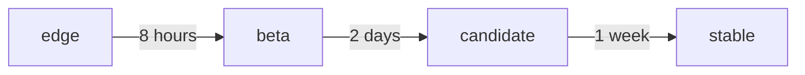

[Channels](https://snapcraft.io/docs/channels) is a software release concept that is similar to [semver](https://semver.org/), and look like this: `track/risk/branch`.

For example:

| Track  | Risk      | Branch | Potetnail use case                     |
| ------ | --------- | ------ | -------------------------------------- |
| latest | edge      | pr-99  | Ephemeral builds during the PR process |
| 2.x    | edge      |        | Latest merge into the `2.x` git branch |
|        | beta      |        |                                        |
|        | candidate |        |                                        |
|        | stable    |        |                                        |

(You can choose how to name tracks and branches, but risk must be one of the above.)

## Quality guarantees

Tagging commits with semver tags is common practice, so what value channels give us? Depends on how we practice promotion across channels :)

If we gate risk promotion with some **compute effort**, then each risk could represent quality guarantees. For example:

## Identify audiences and expectations

Ideally, we'd want to run all tests before merging into main (and that way we wouldn't even need any channels!),
but that is often impractical, because of how long some tests may take.

Think of the risk level as an "inverted funnel": the less risky it is, the larger the audience that is consuming it.

| Risk      | Hypothetical audience                  | Min. due-diligence expected by audience                                      |
| --------- | -------------------------------------- | ---------------------------------------------------------------------------- |
| edge      | Your team                              | Unit tests, integration tests pass; 'it works'                               |
| beta      | Other product teams in your department | Works on various OS/K8s/etc. versions                                        |
| candidate | QA team                                | Integratable with other products                                             |
| stable    | Entire community                       | Backwards compatibility, no performance degradation, multi-substrate support |

## Classify tests into duration bins

Here's an example.

| Quality gate (risk promotion) | Test duration     | Kinds of tests                                                                          |
| ----------------------------- | ----------------- | --------------------------------------------------------------------------------------- |
| edge to beta                  | Less than 8 hours | Matrix tests for infra versions (LXD/K8s/Juju)                                          |
| beta to candidate             | Less than 2 days  | Isolated load test (should be longer than double the longest period in the application) |
| candidate to stable           | More than 2 days  | End-to-end solution tests over multiple substrates                                      |

## Auto-promote!
When tests pass, auto promote to the next risk level. This is also known as continuous delivery :)
