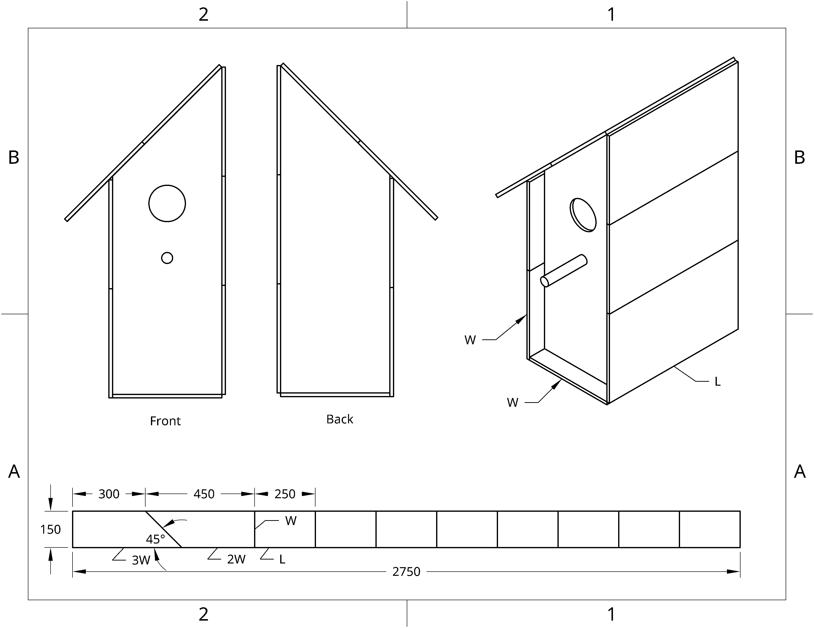

This is a parametric design idea for a single-plank bird house.
 
<!--more-->

The dimensions are determined by two variables:

- Width (W) of the front.
- Length (L) of the bird house (perhaps some would call it depth).

The roof is at 45 degrees, so the left wall height is 2W and the right wall height is 3W.

This means that you need:

- A plank of width W and length 5W+8L.
- Make one cut at 45 degrees.
- Make 8 cuts, producing 8 slabs of W x L.
- A bunch of nails.

In the diagram below,

- W = 150 mm
- L = 250 mm

(Also in [svg](simple-bird-house.svg), [pdf](simple-bird-house.pdf).)
