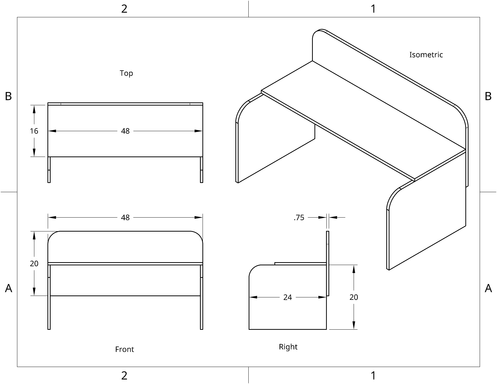

You can build a simple, tipover-safe desk in one evening, using 3 boards and a bunch of screws.

<!--more-->

To keep things simple:

| Qtty | Item                 | Purpose                     |
|-----:|----------------------|-----------------------------|
|    1 | 48x16 inch oak board | Tabletop                    |
|    2 | 48x20 inch oak board | Table legs and back support |
|  ~30 | Wood screws          | Fastening                   |

- Cut one of the 48x20'' boards in half. This would make the legs.
- [90° clamps](https://en.wikipedia.org/wiki/Miter_clamp) can be very useful for maintaining alignment.
- A [jigsaw](https://en.wikipedia.org/wiki/Jigsaw_(tool)) can be useful for rounding corners.

(Also in [svg](simple-diy-desk.svg), [pdf](simple-diy-desk.pdf).)
