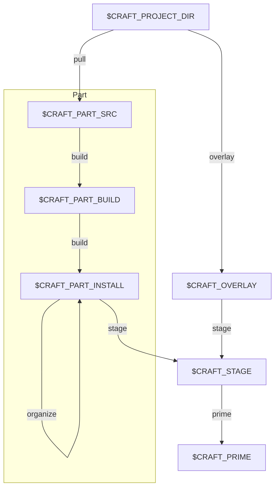

# *craft

## craft-parts
[Ref.](https://canonical-craft-parts.readthedocs-hosted.com/en/latest/reference/parts_steps.html)



## Snapcraft
- [Install LXD](https://github.com/canonical/setup-lxd/blob/main/action.yml)
- ["First snap" generator](https://snapcraft.io/first-snap)
- [Create a developer account](https://forum.snapcraft.io/t/creating-your-developer-account/6760)
- Schema:
    - [top-level](https://snapcraft.io/docs/snapcraft-top-level-metadata)
    - [parts](https://snapcraft.io/docs/snapcraft-parts-metadata)
    - [app & service](https://snapcraft.io/docs/snapcraft-app-and-service-metadata)
    - [plugins](https://snapcraft.io/docs/go-plugin)
- [Supported interfaces](https://snapcraft.io/docs/supported-interfaces)


## Charmcraft

### Publish a charm to charmhub

Publishing to charmhub is straightforward: all you need to do is follow the
register-upload-release workflow.

<!--more-->

Note: in [headless](https://github.com/jaraco/keyring#using-keyring-on-headless-linux-systems)
environments (e.g. multipass), use this:

```bash
dbus-run-session -- bash -c "echo password | gnome-keyring-daemon --unlock; charmcraft <args>"
```


#### Register a new charm's name under your account

```bash
charmcraft names
charmcraft register karma-k8s
```

#### Pack and upload charm

```bash
charmcraft pack
charmcraft upload karma-k8s_ubuntu-20.04-amd64.charm
charmcraft revisions karam-k8s
```

#### Upload resource (e.g. OCI image)

```bash
charmcraft resources karma-k8s
charmcraft status karma-k8s
```

```bash
docker pull ghcr.io/prymitive/karma:v0.92
IMAGE_ID=$(docker images -q ghcr.io/prymitive/karma:v0.92)
charmcraft upload-resource karma-k8s karma-image --image=$IMAGE_ID
charmcraft resource-revisions karma-k8s karma-image
```

```bash
IMAGE="docker://ghcr.io/prymitive/karma:v0.114"
DIGEST=$(skopeo inspect $IMAGE | jq -r '.Digest')

CHARM="karma-k8s"
RESOURCE="karma-image"
charmcraft upload-resource $CHARM $RESOURCE --image=$DIGEST
```

#### Release

```bash
charmcraft release karma-k8s --channel=edge --revision=1 --resource=karma-image:1
charmcraft status karma-k8s
```

### Publish a bundle to charmhub

```bash
charmcraft names
charmcraft register lma-light
charmcraft revisions lma-light

charmcraft pack
charmcraft upload lma-light.zip
charmcraft revisions lma-light

charmcraft release lma-light --channel=edge --revision=1
charmcraft status lma-light
```

### Publish a library
```bash
charmcraft list-lib alertmanager-k8s

# The next command may overwrite existing files, so backup first
charmcraft create-lib alertmanager_remote_configuration

charmcraft publish-lib charms.alertmanager_k8s.v0.alertmanager_remote_configuration
```

See [official docs](https://juju.is/docs/sdk/charmcraft-libraries).

## curl library

### resource revision
```bash
curl -XPOST --header "Content-Type: application/json" -d '{"context":[],"actions":[{"action":"install","instance-key":"this-is-a-test-for-resources-lookup-2025-06-11","name":"prometheus-k8s", "channel": "latest/stable", "base":{"architecture":"amd64","name":"ubuntu","channel":"20.04"}}],"fields":["download","id","name","revision","version", "resources"]}' https://api.charmhub.io/v2/charms/refresh  2>/dev/null | jq
```
